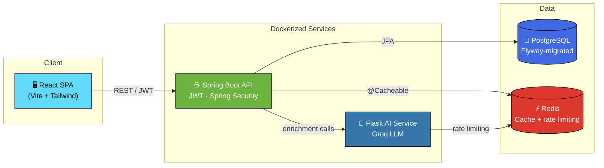

<div align="center">

# 🛡️ Consent Audit Trail

### A production-grade DPDP Act 2023 compliance microservice — track, verify, and prove data consent.

[](#)
[](#)
[](#)
[](#)
[](#)
[](#)
[](#-license)

*Built over a structured 12-day sprint • 9 REST APIs • 21 integration tests*

[Features](#-features) • [Architecture](#-architecture) • [Quick Start](#-quick-start) • [API Reference](#-api-reference) • [Tech Stack](#-tech-stack)

</div>

---

## 📖 About

**Consent Audit Trail** is a full-stack compliance tool built to solve a real problem under India's **Digital Personal Data Protection (DPDP) Act, 2023**: organizations need a defensible, timestamped, queryable record of *who consented to what, when, and under which legal basis* — and they need to prove it on demand.

This system gives you a JWT-secured API + dashboard to create, search, audit, and export consent records, with an AI-assisted layer that auto-generates plain-English compliance summaries and per-record risk descriptions.

> Built as a capstone internship project — from Day 1 scaffold to a fully containerized, tested, production-shaped deployment.

---

## ✨ Features

<table>
<tr>
<td width="50%" valign="top">

### 🔐 Security & Access
- JWT-based stateless authentication
- Role-based access control (`ADMIN` / `USER`)
- BCrypt password hashing
- Spring Security filter chain with CORS lockdown

### 📋 Consent Lifecycle
- Full CRUD on consent records
- Auto-derived status: `ACTIVE`, `PENDING`, `EXPIRED`, `WITHDRAWN`
- Legal basis tracking (Consent, Contract, Legal Obligation, Legitimate Interest)
- Soft-delete with audit trail preservation

</td>
<td width="50%" valign="top">

### 🤖 AI-Assisted Compliance
- Auto-generated plain-English record descriptions
- AI-generated audit report summaries (Groq LLM)
- Graceful fallback when AI service is unreachable

### 📊 Dashboard & Ops
- Real-time KPI dashboard (React + Recharts)
- Full-text search across subject / purpose / email
- One-click CSV export for regulators
- `/actuator/health` readiness probes across all services

</td>
</tr>
</table>

---

## 🏗️ Architecture



Four containers orchestrated via a single `docker-compose.yml`, each with its own healthcheck gating startup order.

---

## 🚀 Quick Start

### Prerequisites
- Docker Desktop (with Compose v2)
- Ports `8081`, `8080`, `5000`, `5432`, `6379` free on your host

### Run it

```bash
git clone https://github.com/<your-username>/consent-audit-trail.git
cd consent-audit-trail
docker compose up -d --build
```

Wait for all containers to report `healthy`:

```bash
docker ps
```

<details>
<summary><strong>🔎 Click to expand: service URLs once running</strong></summary>

| Service        | URL                              | Purpose                          |
|----------------|-----------------------------------|-----------------------------------|
| Frontend       | http://localhost:8081             | React dashboard                  |
| Backend API    | http://localhost:8080             | Spring Boot REST API              |
| Swagger UI     | http://localhost:8080/swagger-ui.html | Interactive API docs         |
| Backend Health | http://localhost:8080/actuator/health | Liveness/readiness probe     |
| AI Service     | http://localhost:5000/health      | Flask AI microservice health     |

</details>

### First login

Seed data is loaded automatically on first boot (`SEED_DATA=true`). Check `backend/src/main/resources/db/migration` or the seeder class for default credentials, or register a new account via `POST /api/auth/register`.

---

## 🔌 API Reference

<details>
<summary><strong>Auth</strong></summary>

| Method | Endpoint              | Description          | Auth |
|--------|------------------------|-----------------------|------|
| `POST` | `/api/auth/login`      | Log in, get JWT       | ❌   |
| `POST` | `/api/auth/register`   | Register new user     | ❌   |

</details>

<details>
<summary><strong>Consents</strong></summary>

| Method   | Endpoint                | Description                    | Auth        |
|----------|---------------------------|----------------------------------|-------------|
| `GET`    | `/api/consents`           | Paginated list                  | ✅          |
| `GET`    | `/api/consents/search?q=` | Search by subject/purpose/email | ✅          |
| `GET`    | `/api/consents/{id}`      | Get single record               | ✅          |
| `POST`   | `/api/consents`           | Create record                   | ✅          |
| `PUT`    | `/api/consents/{id}`      | Update record                   | ✅          |
| `DELETE` | `/api/consents/{id}`      | Soft-delete record               | ✅ ADMIN    |
| `GET`    | `/api/consents/stats`     | KPI stats for dashboard          | ✅          |
| `GET`    | `/api/consents/report`    | AI-generated audit report        | ✅          |
| `GET`    | `/api/consents/export`    | CSV export                       | ✅          |

</details>

<details>
<summary><strong>AI Service (internal)</strong></summary>

| Method | Endpoint                       | Description                          |
|--------|----------------------------------|----------------------------------------|
| `POST` | `/describe`                     | Generate plain-English record description |
| `POST` | `/recommend`                    | Status recommendation                  |
| `POST` | `/generate-report`              | Compliance report summary              |
| `GET`  | `/health`                       | Service health check                   |

</details>

Full interactive documentation is available via **Swagger UI** at `/swagger-ui.html` once the backend is running.

---

## 🧰 Tech Stack

<table>
<tr>
<td valign="top" width="33%">

**Backend**
- Java 17
- Spring Boot 3.2.5
- Spring Security 6 + JWT
- Spring Data JPA
- Flyway migrations
- PostgreSQL 15
- Redis (cache)
- Testcontainers
- Maven

</td>
<td valign="top" width="33%">

**Frontend**
- React 18
- Vite
- Tailwind CSS
- React Router
- Recharts
- Axios

</td>
<td valign="top" width="33%">

**AI Service**
- Python 3 / Flask
- Gunicorn
- Groq LLM API
- Flask-Limiter
- Redis-backed rate limiting

</td>
</tr>
</table>

**Infra:** Docker & Docker Compose · Nginx (frontend serving) · Actuator health checks across all services

---

## 🧪 Testing

```bash
cd backend
mvn test
```

21 integration tests covering the service layer, JWT utilities, and Spring context loading — using **Testcontainers** for a real ephemeral Postgres instance rather than mocks, so the test suite validates actual query behavior.

---

## 📁 Project Structure

```
consent-audit-trail/
├── backend/          # Spring Boot REST API
│   └── src/main/java/com/internship/tool/
│       ├── config/       # Security, CORS, RestTemplate, OpenAPI
│       ├── controller/   # REST endpoints
│       ├── service/      # Business logic
│       ├── entity/       # JPA entities
│       ├── dto/          # Request/response DTOs
│       └── security/     # JWT filter & utils
├── frontend/          # React SPA
│   └── src/
│       ├── pages/        # Dashboard, Consents, Analytics, Login
│       ├── components/   # Navbar, ProtectedRoute, etc.
│       ├── context/       # Auth context
│       └── services/      # Axios API client
├── ai-service/        # Flask AI microservice
│   ├── routes/         # /describe, /recommend, /generate-report
│   ├── services/        # Groq client, fallback logic
│   └── prompts/          # LLM prompt templates
└── docker-compose.yml  # Full-stack orchestration
```

---

## 🗺️ Roadmap

- [ ] Multi-tenant organization support
- [ ] Webhook notifications on consent withdrawal
- [ ] PDF audit report generation (in addition to CSV)
- [ ] Configurable data retention policies

---

## 📄 License

Distributed under the MIT License. See `LICENSE` for details.

---

<div align="center">

**Built by [Yogesh Patil](https://www.linkedin.com/in/yogesh-patil-ms07)**

[LinkedIn](https://www.linkedin.com/in/yogesh-patil-ms07) · [GitHub](https://github.com/yogeshpatil4138-ship-it)

</div>